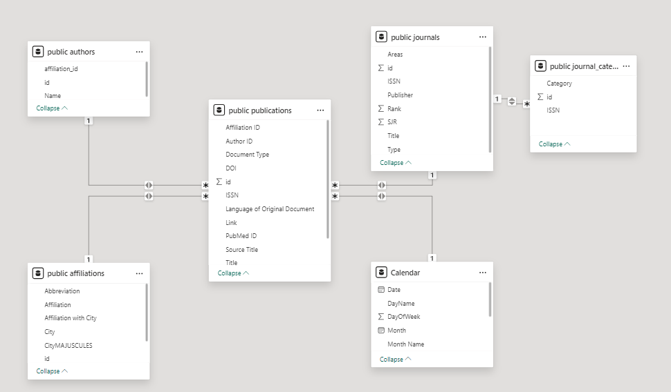

# 🏗️ Data Model Documentation

## 🎯 Overview
This document provides detailed information about the data model used in the Moroccan Universities Scopus Analysis project. The model follows a star schema design pattern, optimized for analyzing academic publications from Moroccan Universities.



## 🌟 Schema Structure

### 📚 Fact Table: Publications

The central fact table storing all academic publications and their metadata.

#### 📋 Fields
| Field Name | Type | Description | Notes |
|------------|------|-------------|--------|
| id | BigInteger | Primary key ⚡ | Unique identifier for each publication |
| Title | String | Publication title 📝 | Full title of the academic work |
| Year | Integer | Publication year 📅 | Year when the work was published |
| Volume | String | Journal volume 📖 | Volume number of the publication |
| Issue | String | Journal issue 📑 | Issue number of the publication |
| ISSN | String | Journal identifier 🔍 | International Standard Serial Number |
| Source_Title | String | Source name 📰 | Journal or conference name |
| Document_Type | String | Publication type 📄 | Can be: article, book series, conference paper |
| DOI | String | Digital identifier 🔗 | Digital Object Identifier for the publication |
| Link | String | Access URL 🌐 | URL to access the publication |
| PubMed_ID | String | PubMed identifier 🏥 | ID in the PubMed database |
| Original_Language | String | Publication language 🌍 | Original language of the document |
| author_id | BigInteger | Author reference 👤 | Foreign key to authors table |
| affiliation_id | Integer | Affiliation reference 🏛️ | Foreign key to affiliations table |

### 📊 Dimension Tables

#### 1. Journals 📰
Stores information about academic journals and their metrics.

| Field Name | Type | Description | Notes |
|------------|------|-------------|--------|
| id | BigInteger | Journal identifier 🔑 | Internal identifier |
| Title | String | Journal name 📚 | Full name of the journal |
| ISSN | String | Primary key 🔍 | International Standard Serial Number |
| Type | String | Journal type 📑 | Classification of the journal |
| Rank | Integer | Journal ranking 🏆 | Ranking position |
| SJR | Float | Impact factor 📈 | SCImago Journal Rank indicator |
| Publisher | String | Publisher name 🏢 | Name of the publishing entity |
| Categories | String | Research domains 🔬 | Research categories covered |

#### 2. Journal Categories 📊
Stores the categories associated with journals.

| Field Name | Type | Description | Notes |
|------------|------|-------------|--------|
| id | Integer | Primary key 🔑 | Unique identifier for each category entry |
| ISSN | String | Journal reference 📚 | Foreign key to journals table |
| Category | String | Category name 🏷️ | Name of the research category |

#### 3. Authors 👥
Contains information about publication authors.

| Field Name | Type | Description | Notes |
|------------|------|-------------|--------|
| id | BigInteger | Primary key 🔑 | Unique identifier for each author |
| Name | String | Author name 👤 | Full name of the author |
| affiliation_id | Integer | Affiliation reference 🏛️ | Foreign key to affiliations table |

#### 4. Affiliations 🏛️
Stores details about academic institutions.

| Field Name | Type | Description | Notes |
|------------|------|-------------|--------|
| id | Integer | Primary key 🔑 | Unique identifier for each institution |
| Affiliation | String | Institution name 🏫 | Full name of the institution |
| Abbreviation | String | Short name ✂️ | Common abbreviation or acronym |
| University | String | University name 🎓 | Parent university name |
| City | String | Location 🌆 | City where institution is located |
| Type | String | Institution type 🏢 | Can be: university, institute, school |

## 🔄 Relationships

### 🔗 Primary to Foreign Key Relationships
- Publications.author_id → Authors.id
- Publications.affiliation_id → Affiliations.id
- Authors.affiliation_id → Affiliations.id
- JournalCategory.ISSN → Journals.ISSN

## 💡 Usage Examples

### 🔍 Common Queries
1. Get all publications from a specific university:
```sql
SELECT p.*
FROM publications p
JOIN affiliations a ON p.affiliation_id = a.id
WHERE a.University = 'University_Name';
```

2. Find top publishing authors:
```sql
SELECT a.Name, COUNT(*) as publication_count
FROM publications p
JOIN authors a ON p.author_id = a.id
GROUP BY a.Name
ORDER BY publication_count DESC;
```

## ✅ Data Quality Rules
1. All publications must have a title
2. Year must be a valid publication year
3. ISSN must follow the standard format
4. Document_Type must be one of the predefined types
5. City names in Affiliations must be valid Moroccan cities

## 📈 Schema Evolution
- Document any changes to the schema structure here
- Include dates and reasons for changes
- Note any migration scripts or procedures needed

## 📚 Additional Resources
- Source code: `models/schema.py`
- ETL Documentation: `docs/etl_process.md`
- Data Dictionary: `docs/data_dictionary.md`
